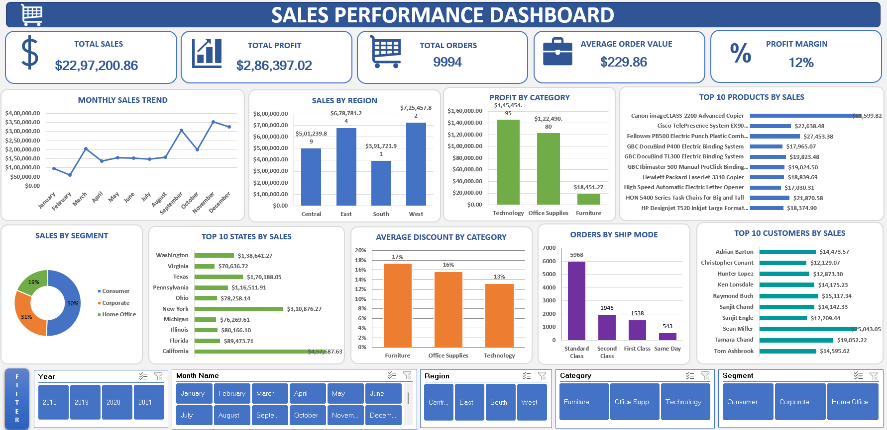

# 📊 Sales Performance Dashboard (Excel)

## 📌 Project Overview

This project is an interactive Sales Performance Dashboard built in Microsoft Excel using a real sales dataset. The dashboard provides key business insights through KPIs, Pivot Tables, Pivot Charts, and interactive slicers, helping users analyze sales performance efficiently.

---

## 🛠️ Tools & Technologies

- Microsoft Excel 2021
- Power Query
- Pivot Tables
- Pivot Charts
- Slicers
- Excel Formulas

---

## 📈 Key Performance Indicators (KPIs)

- Total Sales
- Total Profit
- Total Orders
- Average Order Value
- Profit Margin

---

## 📊 Dashboard Features

- Monthly Sales Trend
- Sales by Region
- Profit by Category
- Top 10 Products
- Sales by Customer Segment
- Top 10 States
- Discount Analysis
- Ship Mode Analysis
- Top 10 Customers
- Interactive Slicers

---

## 🖼️ Dashboard Preview

---

## 💡 Key Insights

- Sales performance can be analyzed across different regions and categories.
- KPI cards provide a quick overview of business performance.
- Interactive slicers allow dynamic filtering by Year, Month, Region, Category, and Customer Segment.
- Charts help identify top-performing products and customer trends.

---

## 🎯 Skills Demonstrated

- Data Cleaning
- Data Transformation
- Dashboard Design
- KPI Development
- Data Visualization
- Business Reporting
- Interactive Reporting

---

## 📂 Project Files

- `Sales_Performance_Dashboard.xlsx`
- `Sales_Performance_Dashboard.png`
- `Sales_Performance_Dashboard.mp4`

---

## 📚 Dataset

Public sales dataset used for educational and portfolio purposes.

---

⭐ Thank you for visiting this project! Feedback and suggestions are always welcome.
